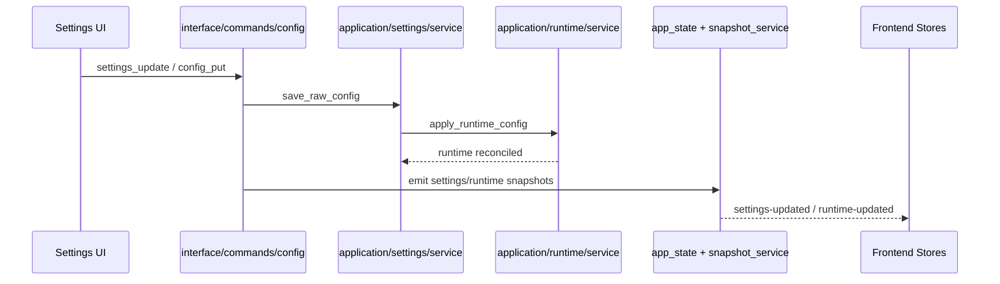
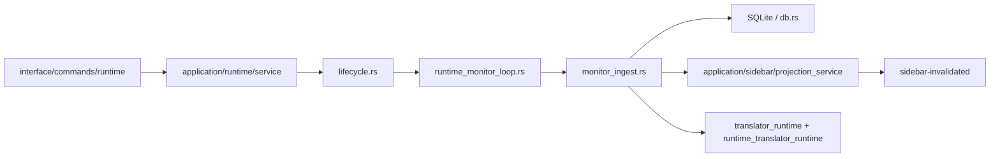
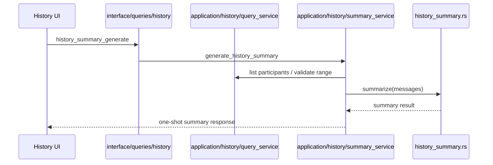

# 架构说明

## 目标

本项目的目标架构不是“页面直接调一堆 Tauri 命令 + 后端散落状态更新”，而是逐步收敛到一套更适合开源维护的桌面应用分层：

- 配置真相只在后端配置仓
- 运行态真相只在后端运行态服务
- 消息与译文真相只在 SQLite
- 前端只保存 snapshot 和页面草稿，不持有业务真相
- 事件只做 whole snapshot 更新或 invalidation，不做局部业务 patch

当前代码还没有到最终形态，但已经完成了大部分主干迁移。

## 分层

### 前端

前端已经开始从“全局 store + 巨型页面组件”收敛到 feature 和 snapshot 分工：

- `src/features/settings/*`
  - `SettingsPage.tsx` 负责页面骨架
  - `useSettingsController.ts` 负责设置页控制器逻辑
  - `draft-store.ts` 负责 feature-local 草稿
- `src/features/sidebar/*`
  - `SidebarView.tsx` 负责浮窗展示
  - `useSidebarSnapshot.ts` 负责 invalidation 后的快照刷新
- `src/stores/settingsStore.ts`
  - 保存 settings snapshot
- `src/stores/runtimeStore.ts`
  - 保存 runtime snapshot
- `src/stores/sidebarStore.ts`
  - 保存 sidebar snapshot + invalidation 状态
- `src/stores/uiPreferencesStore.ts`
  - 只保存纯 UI 偏好，不影响后端行为

### 后端

后端现在已经形成了比较清晰的层次：

```text
src-tauri/src/
  interface/
    commands/
    queries/

  application/
    runtime/
    sidebar/
    history/
    settings/

  infrastructure/
    tauri/

  adapter/
  db.rs
  history_summary.rs
  task_manager.rs
```

#### `interface`

`interface/*` 是当前 Tauri 对外暴露面的目标落点。

- `interface/commands/*`
  - 暴露所有写操作
  - 例如监听启停、sidebar 启停、配置写入、权限恢复、托盘偏好等
- `interface/queries/*`
  - 暴露所有读操作
  - 例如 `app_state_get`、`sidebar_snapshot_get`、历史消息查询、总结查询、会话查询等

#### `application`

`application/*` 负责业务用例和编排。

##### `application/runtime/*`

- `service.rs`
  - 运行态应用服务门面
  - 对外为 command/query 层提供统一访问
- `lifecycle.rs`
  - 监听启停、等待退出、恢复重建、循环收尾
- `read_service.rs`
  - 读取任务状态、翻译状态、sidebar 投影、首次 poll 信号
- `snapshot_service.rs`
  - 组装 runtime snapshot 和 app snapshot
- `status_sync.rs`
  - 任务状态事件、翻译代际号、runtime-updated 回流
- `translator_runtime.rs`
  - 翻译配置应用、手动翻译触发
- `sidebar_runtime.rs`
  - sidebar 启停、翻译依赖装配、投影清理
- `monitor_loop.rs`
  - 监听主循环实现
- `monitor_ingest.rs`
  - 消息增量判定与 sender 推断逻辑
- `state.rs`
  - `TaskState`、`SidebarConfig`、`FirstPollSignal`、`MonitorConfig`
- `translation_config.rs`
  - 统一构建翻译运行时配置

##### `application/sidebar/*`

- `projection_service.rs`
  - 当前聊天与 refresh version 的 owner
- `snapshot_service.rs`
  - 根据 projection + SQLite 生成 sidebar 读模型快照

##### `application/history/*`

- `query_service.rs`
  - 历史消息列表、会话摘要、统计、成员列表查询
- `summary_service.rs`
  - 历史总结业务用例编排

##### `application/settings/*`

- `service.rs`
  - 配置校验、落盘、运行态应用

#### `infrastructure`

`infrastructure/*` 负责平台适配。

- `infrastructure/tauri/tray_adapter.rs`
  - 托盘菜单状态投影

## 单一真相源

### 配置

- owner: `application/settings/service.rs` + `config.rs`
- 持久化: `config/listener.json`
- 前端只拿 snapshot，不本地持有业务真相

### 运行态

- owner: `application/runtime/*`
- 持久化: 内存
- 前端通过 `runtime-updated` whole snapshot 替换

### Sidebar 投影

- owner: `application/sidebar/projection_service.rs`
- 持久化: 内存
- 前端通过 `sidebar-invalidated -> sidebar_snapshot_get` 重建

### 消息 / 译文

- owner: `db.rs`
- 持久化: SQLite
- 前端不通过事件 patch 消息内容，只重新拉 snapshot/query

## 事件模型

当前事件分工已经比早期清晰很多：

- `settings-updated`
  - whole settings snapshot
- `runtime-updated`
  - whole runtime snapshot
- `sidebar-invalidated`
  - 只表示 sidebar 读模型失效
- `wechat-event`
  - 偏日志/调试事件

设计原则：

- 不允许前端通过日志事件直接 patch 业务真相
- 不允许同一事实同时由命令返回值和事件双写

## 关键数据流

### 1. 设置保存流



### 2. 监听运行流



### 3. Sidebar 快照流

```mermaid
sequenceDiagram
  participant Loop as Monitor / Translator
  participant Projection as Sidebar Projection
  participant Event as sidebar-invalidated
  participant Query as interface/queries/sidebar
  participant SnapshotSvc as application/sidebar/snapshot_service
  participant UI as Sidebar UI

  Loop->>Projection: bump current_chat / version
  Projection->>Event: sidebar-invalidated
  UI->>Query: sidebar_snapshot_get
  Query->>SnapshotSvc: load_sidebar_snapshot
  SnapshotSvc-->>UI: current_chat + messages + translator + refresh_version
```

### 4. 历史总结流



## 维护规则

后续继续重构时，建议坚持下面几条：

- 新的 Tauri 暴露面放在 `interface/*`
- 新的业务编排放在 `application/*`
- 前端业务真相一律走 snapshot / invalidation 模式
