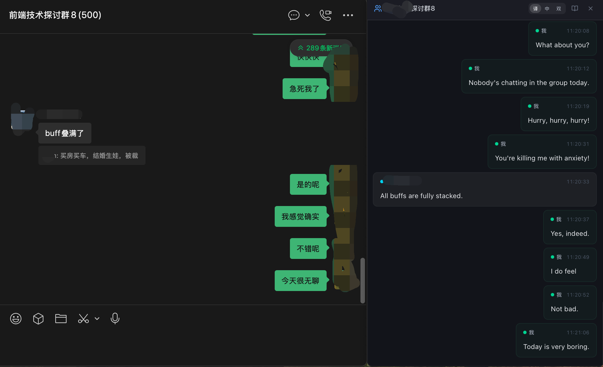
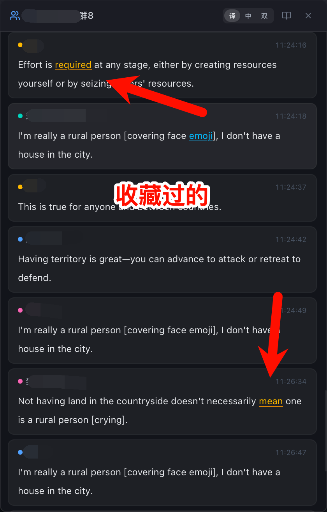
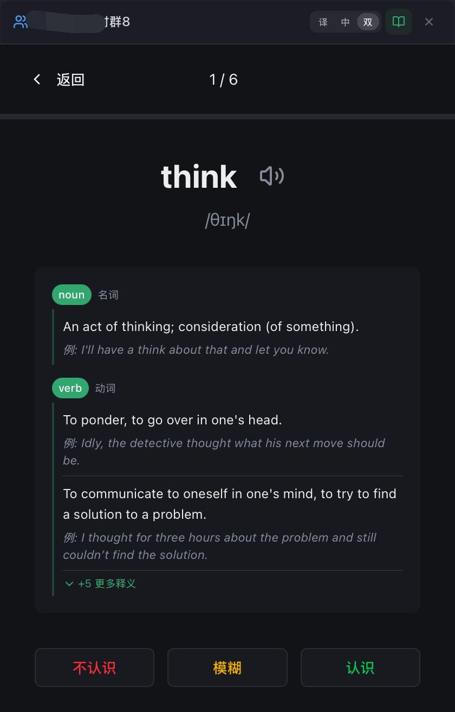
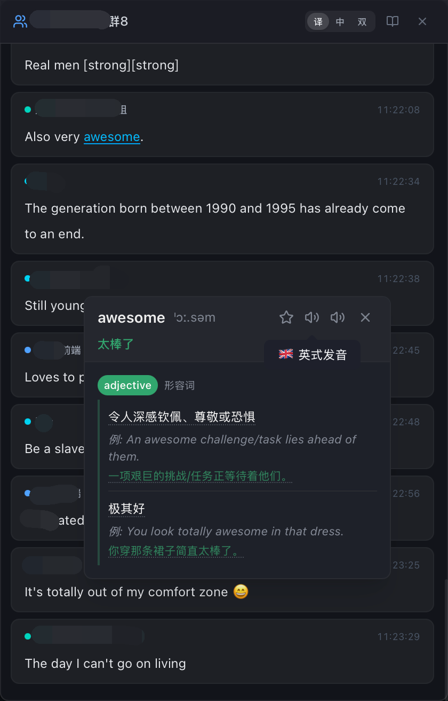
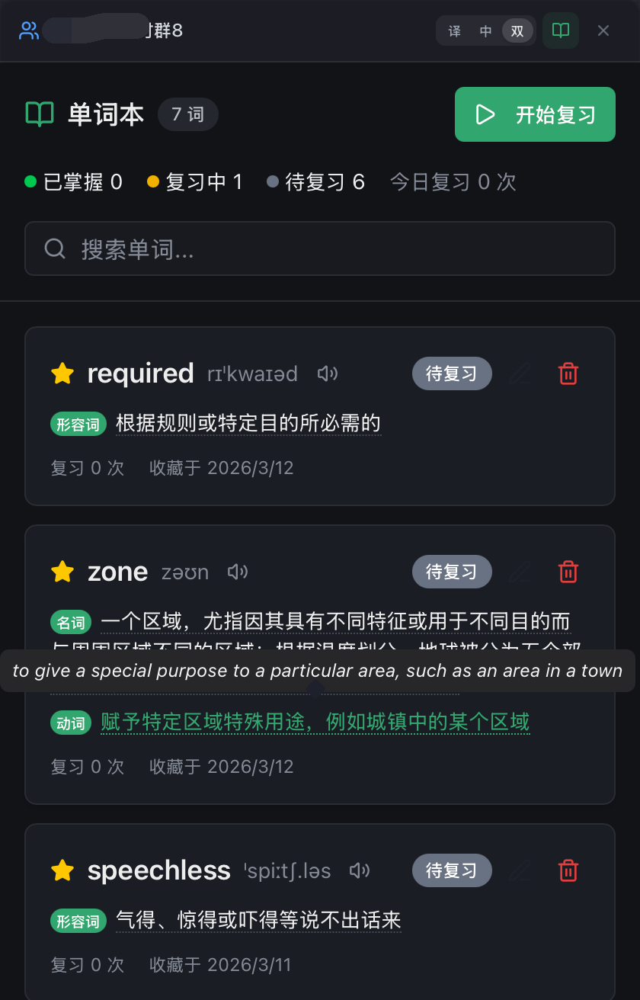
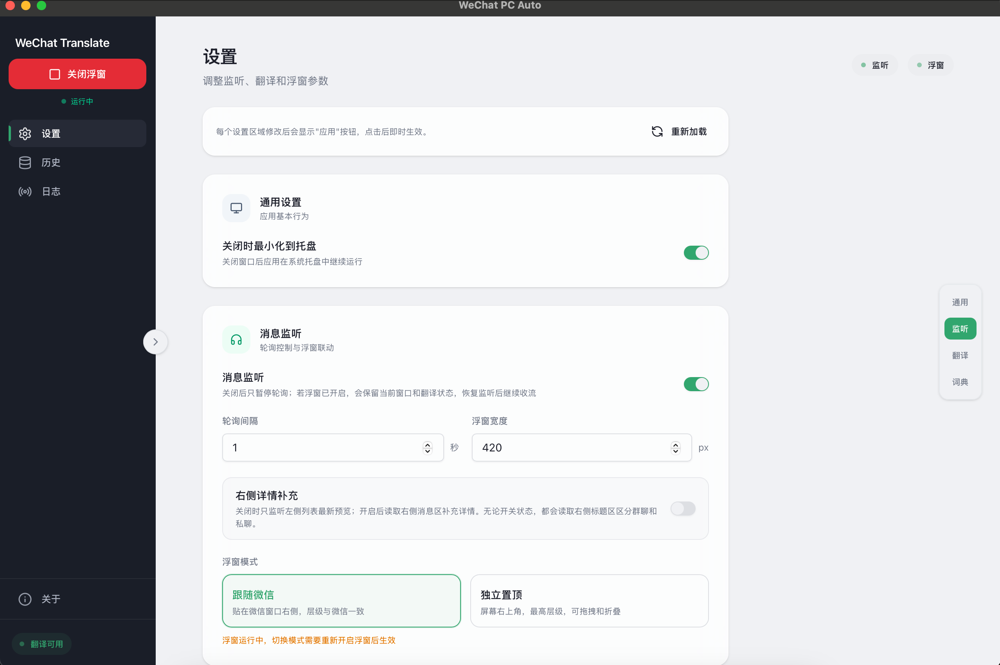
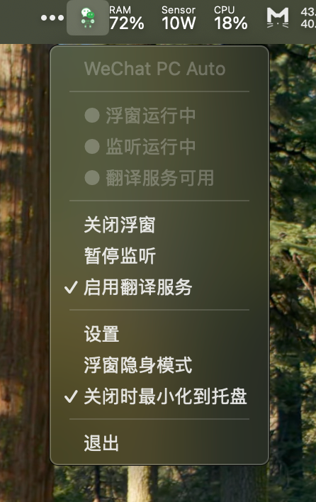
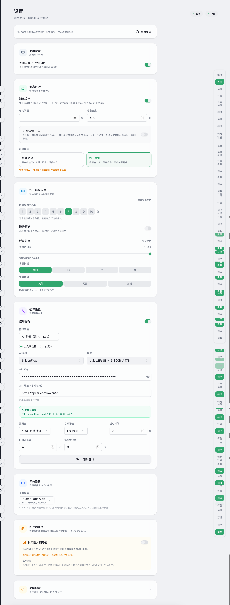
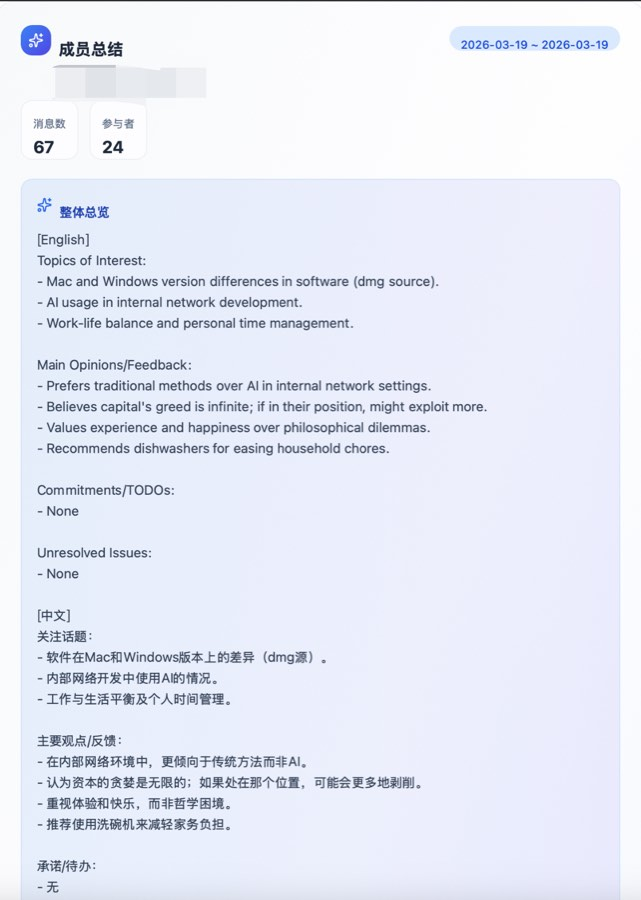
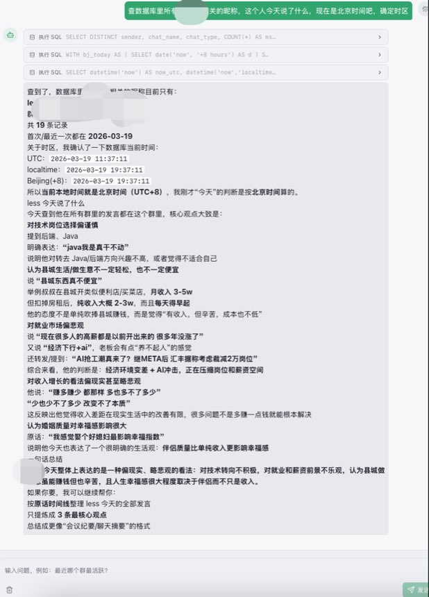

# WeChat PC Auto — Rust 原生版

> 基于 **Tauri 2 + React 19 + Rust** 构建的 macOS 微信桌面端自动化工具，  
> 通过 macOS Accessibility API 与 AppleScript 直接驱动微信，无 Python 依赖。

## 界面预览

### 浮窗功能
| 跟随微信窗口模式 | 独立置顶模式 |
|---|---|
|  |  |

### 查词功能
| 点词查询 | 词典窗口 | 音标释义 | 例句展示 |
|---|---|---|---|
|  |  |  |  |

### 设置中心
| 主设置页 | 工具栏设置 | 完整设置 |
|---|---|---|
|  |  |  |

### AI 能力预览
| AI 总结卡片 | Text2SQL AI Agent |
|---|---|
|  |  |

- **AI 总结卡片**：支持按群聊、按成员、按时间范围生成结构化总结，把关注议题、主要观点、承诺待办和未决问题直接提炼出来，适合快速回看讨论重点。
- **Text2SQL AI Agent**：直接对消息数据库发起自然语言问答，Agent 自动生成 SQL、执行检索并返回可解释答案，适合做聊天记录追问和线索回溯。

## 核心亮点

- **双模式实时浮窗翻译**：支持跟随微信窗口或独立置顶，原文 / 译文 / 双语视图可切换，适合边聊边学英文
- **AI Agent 消息问答**：内置 Agent 会话能力，可直接对消息库发起自然语言问答，并通过 Text2SQL 获取结构化答案
- **AI 总结**：支持按群聊、按成员、按时间范围生成历史总结，也支持跨所有群聊做全局整体总结
- **系统 TTS 朗读**：基于 macOS 系统 TTS 朗读消息或译文，支持打断式播报，并把“正在朗读”状态实时回传到消息卡片
- **监听异常托盘闪动提醒**：当监听链路异常时，托盘图标会进入闪动状态，同时把菜单状态切到“监听异常”，降低静默掉线风险
- **查词 + 单词本闭环**：聊天里看到生词可以直接点词、看音标释义、听发音、收藏进单词本继续复习

## 技术栈

| 层级 | 技术 |
|------|------|
| **桌面框架** | Tauri 2 (原生窗口 + 系统托盘 + IPC) |
| **前端** | React 19 + TypeScript + Vite 7 |
| **样式** | Tailwind CSS v4 + shadcn/ui |
| **状态管理** | Zustand |
| **后端** | Rust (tokio async) |
| **数据库** | SQLite (rusqlite) |
| **翻译** | DeepLX HTTP |
| **macOS 自动化** | accessibility-sys + AppleScript |

## 功能概览

- **智能消息监听** — 左侧会话预览 + 右侧详情补充双路径采集，结合锚点、尾部追加和 Bag Diff 算法识别新消息，并区分群聊/私聊/自己发送
- **双模式实时浮窗，实时翻译英文，以达到学习的目的** — 支持跟随微信窗口或独立置顶模式，提供原文/译文/双语显示、最近 N 条折叠展示、隐身模式与外观自定义
- **多渠道翻译** — 支持 DeepLX 与 AI 翻译渠道切换，内置翻译测试、健康检查、限流配置和译文回写/缓存
- **消息历史与数据管理** — SQLite 持久化消息、译文与图片路径，支持会话列表、关键词/发送人筛选、分页、统计以及清库后自动重启监听
- **查词与发音** — 浮窗英文可直接点词查询，支持 Cambridge / Free Dictionary，展示音标、释义、例句，并带音频缓存播放
- **单词本与复习** — 支持收藏单词、笔记、掌握度、复习记录与复习会话，适合把聊天里的生词沉淀下来
- **设置中心与高级配置** — 可视化调整监听、翻译、浮窗、词典和图片缩略图参数，也支持直接编辑 JSON 配置并恢复默认值
- **运行态监控与权限引导** — 内置微信/辅助功能/窗口状态预检、实时事件流、服务日志和翻译状态提示，便于排障
- **系统托盘与版本检查** — 托盘可一键开关监听/浮窗/翻译，支持关闭到托盘、主窗口隐藏恢复，以及关于页检查 GitHub 最新版本

## 快速开始

### 前置条件

- macOS 13+
- [Rust](https://rustup.rs/) (stable) + [Node.js](https://nodejs.org/) 18+ & [pnpm](https://pnpm.io/)
- 微信 macOS 客户端已安装并登录
- **系统设置 → 隐私与安全 → 辅助功能** 中授权终端/IDE

### 开发模式

```bash
pnpm install
pnpm tauri dev
```

### 构建发布

```bash
pnpm tauri build
```

## 架构设计

### 整体架构

```
┌─────────────────────────────────────────────────────┐
│                 前端 (React + Vite)                  │
│  ┌─────────┐ ┌─────────┐ ┌─────────┐ ┌───────────┐  │
│  │ 设置页面 │ │消息历史 │ │词典/单词本│ │ 日志/事件 │  │
│  └─────────┘ └─────────┘ └─────────┘ └───────────┘  │
│  ┌─────────────────────────────────────────────────┐│
│  │          实时浮窗 (SidebarView)                  ││
│  └─────────────────────────────────────────────────┘│
│  Stores: eventStore · sidebarStore · formStore      │
└────────────────────────┬────────────────────────────┘
                         │ Tauri IPC
                         ▼
┌─────────────────────────────────────────────────────┐
│                  Tauri 后端 (Rust)                   │
│  ┌───────────────────────────────────────────────┐  │
│  │ TaskManager (消息差集 · 翻译 · 入库 · 事件发布) │  │
│  └───────────────────────────────────────────────┘  │
│  EventStore · MessageDb · SidebarRuntime · Config   │
└────────────────────────┬────────────────────────────┘
                         │ AX API / AppleScript
                         ▼
                   微信 macOS 客户端
```

### 消息监听流程

```
启动监听 → TaskManager::monitor_loop (tokio::spawn)
    │
    ├─ 1. AX API 读取当前会话名 (read_active_chat_name)
    ├─ 2. AX API 读取消息列表 (read_chat_messages_rich)
    ├─ 3. 消息差集算法 (锚点法 → 尾部追加 → Bag Diff)
    │
    └─ 新消息处理
        ├─ MessageDb 入库 (SHA256 去重)
        ├─ EventStore 广播事件
        └─ Sidebar? → 翻译推送 (DeepLX)
```

## 悬浮窗数据流

### 核心数据流

```
微信客户端          Rust 后端                    前端 (React)
    │                   │                           │
    │  AX API 轮询      │                           │
    │◀──────────────────│                           │
    │  返回消息         │                           │
    │──────────────────▶│                           │
    │                   │                           │
    │                   │ 消息入库 (SQLite)          │
    │                   │ 更新 SidebarRuntime       │
    │                   │   current_chat            │
    │                   │   refresh_version++       │
    │                   │                           │
    │                   │ 发布 sidebar-refresh ────▶│ requestRefresh()
    │                   │                           │ → refreshVersion++
    │                   │                           │
    │                   │◀───────────────────────────│ fetchSnapshot()
    │                   │                           │
    │                   │ 返回快照 ────────────────▶│ hydrateSnapshot()
    │                   │ { current_chat,           │ → items 替换
    │                   │   messages,               │ → UI 渲染
    │                   │   refresh_version }       │
    │                   │                           │
    │                   │ 异步翻译 (spawn)           │
    │                   │ db.update_translation()   │
    │                   │                           │
    │                   │ 发布 sidebar-refresh ────▶│ 再次拉取快照
    │                   │                           │ → 译文显示 ✓
```

### 消息入库路径

消息入库有两个代码路径，**均会触发翻译和悬浮窗刷新**：

| 路径 | 条件 | 数据质量 |
|------|------|---------|
| **详细消息** (chat) | `use_right_panel_details=true` | 高 (完整内容) |
| **会话预览** (session_preview) | `use_right_panel_details=false` | 低 (预览片段) |

### 核心状态

**后端 (Rust)**：

```rust
pub struct SidebarRuntime {
    current_chat: Mutex<String>,   // 当前聊天（后端真相源）
    refresh_version: AtomicU64,    // 刷新版本号
}
```

**前端 (TypeScript)**：

```typescript
interface SidebarStoreState {
  items: SidebarMessage[];      // 消息列表
  currentChat: string;          // 当前聊天
  refreshVersion: number;       // 触发 fetchSnapshot
  remoteRefreshVersion: number; // 后端版本
}
```

### 事件机制

| 事件 | 触发时机 | 前端处理 |
|------|---------|---------|
| `chat_switched` | 聊天切换后 | `setCurrentChat()` → 标题更新 |
| `sidebar-refresh` | 聊天切换 / 消息入库 / 译文写回 | `requestRefresh()` → 拉取快照 |

**聊天切换流程**（用户在微信中点击不同聊天）：
1. AX API 检测到 `chat_name` 变化
2. 防抖阈值（连续 2 次相同）确认切换
3. 发布 `chat_switched` → 前端标题立即更新
4. 发布 `sidebar-refresh` → 前端拉取新聊天历史消息

### 翻译流程

```
消息入库 → spawn 异步翻译
    │
    ├─ 检查翻译缓存 (message_translations)
    │   ├─ 命中 → 写回 messages.content_en
    │   └─ 未命中 → DeepLX API → 写入缓存 + 写回
    │
    └─ 发布 sidebar-refresh → 前端拉取快照 → 译文显示
```

### 关键设计

| 设计 | 原因 |
|------|------|
| **后端维护 current_chat** | 避免前端拼状态不一致 |
| **提交后刷新** | 确保前端拉取时数据已落盘 |
| **快照拉取** | 简化逻辑，避免消息乱序/丢失 |
| **防空列表闪断** | 空列表时保留旧内容 |

## 项目结构

```
rust/
├── src/                    # 前端 (React + TypeScript)
│   ├── components/         # 页面组件
│   ├── stores/             # Zustand stores
│   └── lib/                # API + 类型
│
└── src-tauri/              # Rust 后端
    └── src/
        ├── task_manager.rs # 核心任务调度
        ├── db.rs           # SQLite 持久化
        ├── translator.rs   # DeepLX 客户端
        ├── adapter/        # macOS 适配层
        └── commands/       # Tauri 命令
```

## 数据存储

| 数据 | 路径 |
|------|------|
| 消息数据库 | `~/Library/Application Support/com.wang.wechat-pc-auto/messages.db` |
| 配置文件 | `~/Library/Application Support/com.wang.wechat-pc-auto/config/listener.json` |

## 调试命令

```bash
# AX API 测试
cargo run --bin ax-test

# AX 控件树导出
cargo run --bin ax-dump
```

## FAQ

### 1. 每次版本更新后需要重新授权辅助功能

**问题**：每次更新版本后，软件无法正常工作，需要重新设置辅助功能权限。

**原因**：由于没有官方开发者账号，每次打包时应用的签名都会发生变化，macOS 会将其识别为新的应用。

**解决方案**：
1. 打开 **系统设置 → 隐私与安全 → 辅助功能**
2. 找到旧版本的应用，点击 **-** 号将其完全移除
3. 重新运行新版本应用，点击 **+** 号添加应用并授权

### 2. 首次安装后的授权流程

**问题**：第一次安装后，设置页面显示已授权但功能无法正常使用。

**解决方案**：
1. 首次运行时会弹出授权请求，点击 **允许**
2. 在设置页面确认显示 **"已授权"** 状态
3. **完全关闭本软件**（确保进程完全退出）
4. 重新打开软件，此时即可正常开启监听功能

**注意**：授权后必须重启应用才能获取到完整的辅助功能权限。

## 许可证

MIT

## 项目地址

| 平台 | 地址 |
|------|------|
| **GitHub** | https://github.com/congwa/wechat-translate |
| **Gitee** | https://gitee.com/cong_wa/wechat-translate |

## 致谢

### 💝 特别感谢

本项目的 macOS 版本灵感来源于 **Loveyless** 的天才想法和卓越的动手能力。

**Loveyless** 创建的 [wechat-pc-auto](https://github.com/Loveyless/wechat-pc-auto) 项目开创了先河，其创新的思路和扎实的技术实现为本项目奠定了坚实的基础。

正是因为有了这样优秀的原版项目作为起点，才得以让 macOS 版本顺利诞生，为广大 Mac 用户带来同样便捷的英语学习体验。

### 🌟 致敬原作

- **原版项目**: [wechat-pc-auto](https://github.com/Loveyless/wechat-pc-auto)
- **原作者**: [Loveyless](https://github.com/Loveyless)
- **贡献**: 开创性的解决方案，为整个项目生态提供了宝贵的思路和技术积累

感谢 **Loveyless** 的开源精神和技术分享，让更多人能够受益于英语学习的便利。愿这份技术的火种继续传递，照亮更多开发者的创新之路。

---

*"一个人的灵感，点燃了另一个人的梦想；一个人的分享，成就了更多人的可能。"*

**—— 向所有开源先驱者致敬**

## 交流群

欢迎加入我们的交流群，一起探讨技术、分享经验，共同让这个项目变得更好！


