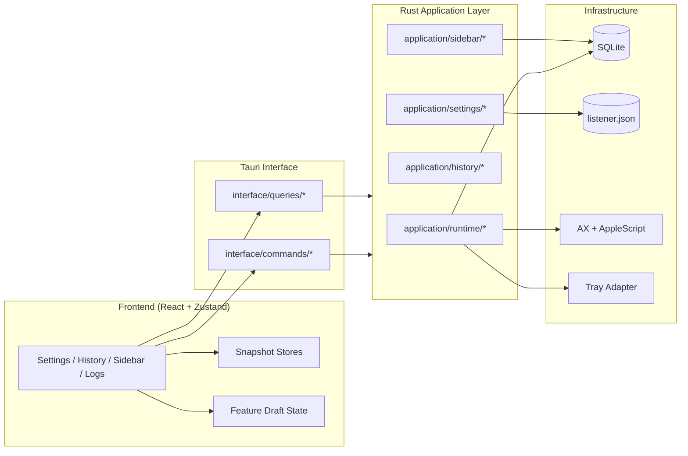
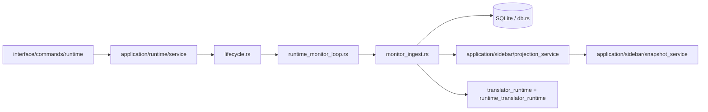

# WeChat PC Auto — Rust 原生版

> 基于 **Tauri 2 + React 19 + Rust** 构建的 macOS 微信桌面端自动化工具，  
> 通过 macOS Accessibility API 与 AppleScript 直接驱动微信，无 Python 依赖。

## 技术栈

| 层级 | 技术 |
|------|------|
| **桌面框架** | Tauri 2 (原生窗口 + 系统托盘 + IPC) |
| **前端** | React 19 + TypeScript + Vite 7 |
| **样式** | Tailwind CSS v4 + shadcn/ui |
| **状态管理** | Zustand |
| **后端** | Rust (tokio async) |
| **数据库** | SQLite (rusqlite) |
| **翻译** | DeepLX HTTP |
| **macOS 自动化** | accessibility-sys + AppleScript |

## 功能概览

- **消息监听** — 实时轮询微信消息，基于锚点+差集算法精准识别新消息
- **实时浮窗** — 紧贴微信窗口的浮动翻译窗口，支持原文/译文/双语模式
- **DeepLX 翻译** — 消息自动翻译，支持翻译缓存
- **消息历史** — SQLite 存储，支持搜索、分页、会话列表
- **系统托盘** — 快捷开关浮窗/监听/翻译

## 快速开始

### 前置条件

- macOS 13+
- [Rust](https://rustup.rs/) (stable) + [Node.js](https://nodejs.org/) 18+ & [pnpm](https://pnpm.io/)
- 微信 macOS 客户端已安装并登录
- **系统设置 → 隐私与安全 → 辅助功能** 中授权终端/IDE

### 开发模式

```bash
pnpm install
pnpm tauri dev
```

### 构建发布

```bash
pnpm tauri build
```

## 架构设计

当前代码已经从“前端直接调一堆命令 + 后端由 `TaskManager` 一把抓”逐步收敛到更清晰的层次：

- `interface/commands`
  - Tauri 对外写命令入口
- `interface/queries`
  - Tauri 对外读查询入口
- `application/runtime`
  - 运行时生命周期、状态同步、snapshot、sidebar/translator 编排
- `application/history`
  - 历史查询与 AI 总结用例
- `application/sidebar`
  - sidebar 投影与 snapshot 读模型
- `application/settings`
  - 配置校验、落盘、运行态应用
- `commands/*`
  - 旧命令兼容实现层，逐步退场

完整说明见：

- [ARCHITECTURE.md](./ARCHITECTURE.md)

### 当前整体结构



### 当前数据流原则

| 原则 | 当前做法 |
|------|------|
| **配置真相源** | 只在后端配置文件与 `application/settings/service.rs` |
| **运行态真相源** | 只在后端 runtime service / state / snapshot service |
| **消息真相源** | 只在 SQLite |
| **前端同步方式** | whole snapshot 或 invalidation 后重查 |
| **Sidebar 更新方式** | `sidebar-invalidated` + `sidebar_snapshot_get` |
| **历史总结方式** | one-shot query，不写入全局 store |

### 当前监听主链



### 当前 Sidebar 数据流

```mermaid
sequenceDiagram
  participant Loop as Monitor / Translator
  participant Projection as Sidebar Projection
  participant Query as interface/queries/sidebar
  participant SnapshotSvc as application/sidebar/snapshot_service
  participant UI as Sidebar UI

  Loop->>Projection: update current_chat / refresh_version
  Projection-->>UI: sidebar-invalidated
  UI->>Query: sidebar_snapshot_get
  Query->>SnapshotSvc: load_sidebar_snapshot
  SnapshotSvc-->>UI: whole sidebar snapshot
```

## 项目结构

```text
rust/
├── src/                          # 前端 (React + TypeScript)
│   ├── features/                 # feature 页面与 controller / hooks
│   ├── components/               # 通用页面组件与兼容导出
│   ├── stores/                   # snapshot stores + UI stores
│   └── lib/                      # Tauri API + 类型
│
├── ARCHITECTURE.md               # 当前架构、数据流与层次说明
└── src-tauri/                    # Rust 后端
    └── src/
        ├── interface/            # Tauri commands / queries 暴露面
        ├── application/          # 业务编排与读写用例
        ├── infrastructure/       # Tauri / tray 等平台适配
        ├── commands/             # 旧命令兼容实现层
        ├── adapter/              # macOS AX / AppleScript 适配层
        ├── db.rs                 # SQLite 持久化
        ├── history_summary.rs    # AI 总结引擎
        └── task_manager.rs       # 运行态聚合容器（已明显瘦身）
```

## 数据存储

| 数据 | 路径 |
|------|------|
| 消息数据库 | `~/Library/Application Support/com.wang.wechat-pc-auto/messages.db` |
| 配置文件 | `~/Library/Application Support/com.wang.wechat-pc-auto/config/listener.json` |

## 调试命令

```bash
# AX API 测试
cargo run --bin ax-test

# AX 控件树导出
cargo run --bin ax-dump
```

## 许可证

MIT
